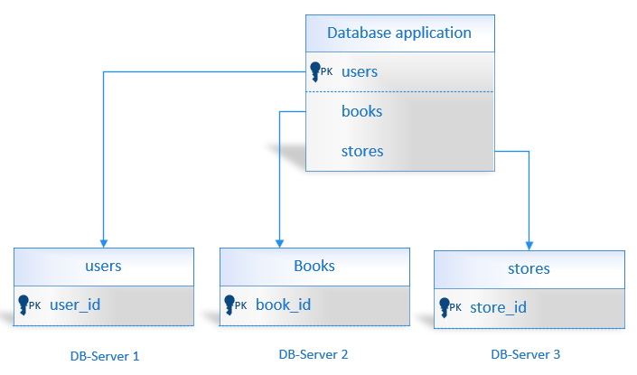
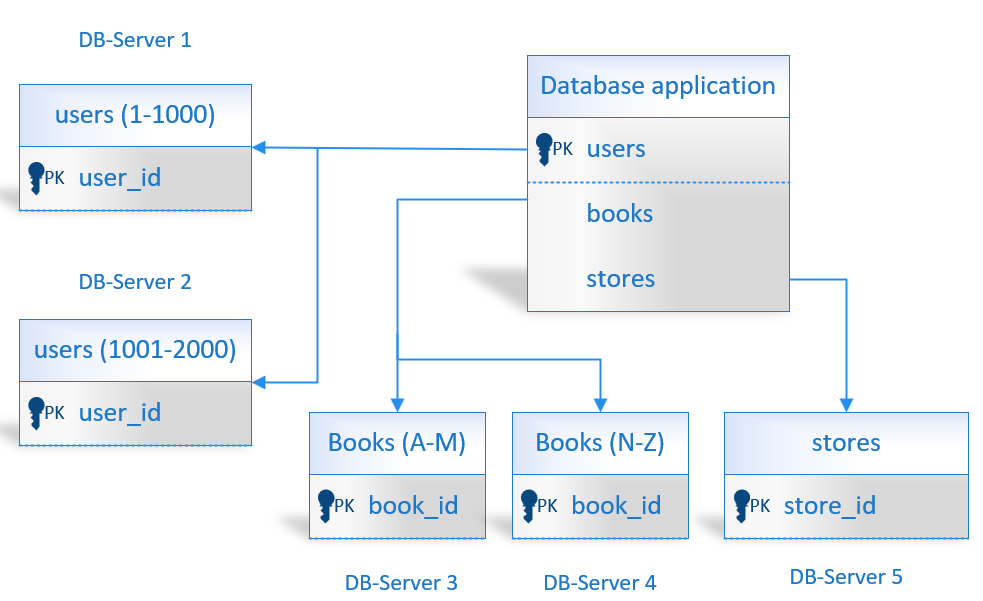

# Домашнее задание к занятию «Репликация и масштабирование. Часть 2» Андрей Дёмин

### Задание 1

Опишите основные преимущества использования масштабирования методами:

- активный master-сервер и пассивный репликационный slave-сервер; 
- master-сервер и несколько slave-серверов;
- активный сервер со специальным механизмом репликации — distributed replicated block device (DRBD);
- SAN-кластер.

*Дайте ответ в свободной форме.*

<ins>Ответ</ins>:

- активный master-сервер и пассивный репликационный slave-сервер --> отказоустойчивость + распределение нагрузки;
- master-сервер и несколько slave-серверов --> высокий уровень отказоустойчивости и балансировки нагрузки;
- активный сервер со специальным механизмом репликации – distributed replicated block device (DRBD) --> обеспечение высокой доступности и отказоустойчивости  путем применения методов синхронной репликации, полусинхронной и асинхронной репликации, а также в связи с отсутствием единой точки отказа; 
- SAN-кластер --> высокая производительность и доступность за счет виртуализации данных, а также высокая отказоустойчивость за счет зеркалирования данных и непрерывного резервного копирования благодаря изоляции Backup-трафика от трафика локальной сети.
---

### Задание 2

Разработайте план для выполнения горизонтального и вертикального шаринга базы данных. База данных состоит из трёх таблиц: 

- пользователи, 
- книги, 
- магазины (столбцы произвольно). 

Опишите принципы построения системы и их разграничение или разбивку между базами данных.

*Пришлите блоксхему, где и что будет располагаться. Опишите, в каких режимах будут работать сервера.* 

<ins>Ответ</ins>:

1. Вертикальный шардинг - каждая таблица БД перенесена на отдельный сервер.

2. Горизонтальный шардинг - таблицы БД, содержащие  данные пользователей для авторизации и совершения транзакций распределяются на несколько серверов по мере увеличения количества.
Таблицы, содержащие данные о книгах, также распределены на два сервера.

 

